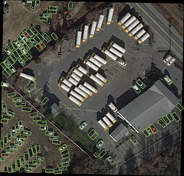
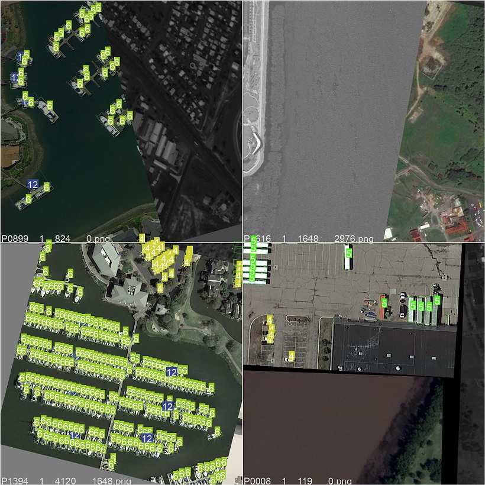
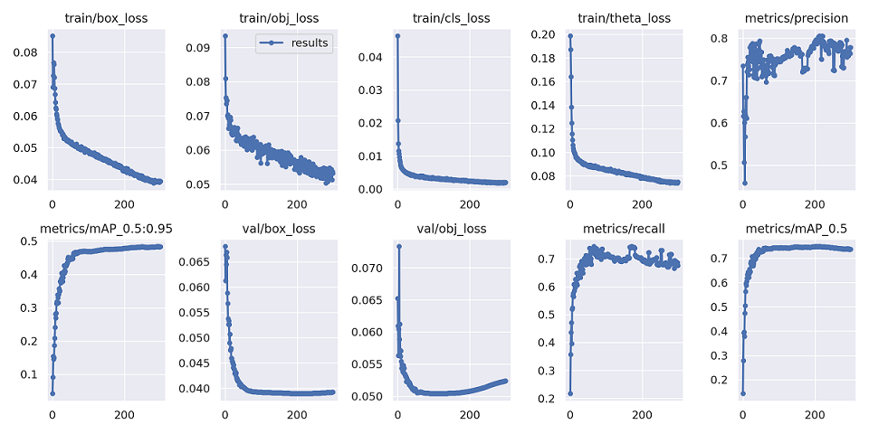

# Yolov5 for Oriented Object Detection




The code for the implementation of “[Yolov5](https://github.com/ultralytics/yolov5) + [Circular Smooth Label](https://arxiv.org/abs/2003.05597v2)”. 

# Results and Models
The results on **DOTA_subsize1024_gap200_rate1.0** test-dev set are shown in the table below. (**password: yolo**)

 |Model<br><sup>(download link) |Size<br><sup>(pixels) | TTA<br><sup>(multi-scale/<br>rotate testing) | OBB mAP<sup>test<br><sup>0.5<br>DOTAv1.0 | OBB mAP<sup>test<br><sup>0.5<br>DOTAv1.5 | OBB mAP<sup>test<br><sup>0.5<br>DOTAv2.0 | Speed<br><sup>CPU b1<br>(ms)|Speed<br><sup>2080Ti b1<br>(ms) |Speed<br><sup>2080Ti b16<br>(ms) |params<br><sup>(M) |FLOPs<br><sup>@640 (B) 
 | ----                                                                                                                                                           | ---  | ---   | ---      | ---   | ---   | ---   | ---   | --- | --- | ---
 |yolov5m [[baidu](https://pan.baidu.com/s/1UPNaMuQ_gNce9167FZx8-w)/[google](https://drive.google.com/file/d/1NMgxcN98cmBg9_nVK4axxqfiq4pYh-as/view?usp=sharing)]  |1024  | ×     |**77.3** |**73.2** |**58.0**  |**328.2**      |**16.9**     |**11.3**      |**21.6**   |**50.5**   
 |yolov5s [[baidu](https://pan.baidu.com/s/1Lqw42xlSZxZn-2gNniBpmw?pwd=yolo)]    |1024  | ×     |**76.8**   |-      |-      |-      |**15.6**  | -     |**7.5**     |**17.5**    
 |yolov5n [[baidu](https://pan.baidu.com/s/1Lqw42xlSZxZn-2gNniBpmw?pwd=yolo)]    |1024  | ×     |**73.3**   |-      |-      |-      |**15.2**  | -     |**2.0**     |**5.0**


<details>
  <summary>Table Notes (click to expand / **点我看更多**)</summary>

* All checkpoints are trained to 300 epochs with [COCO pre-trained checkpoints](https://github.com/ultralytics/yolov5/releases/tag/v6.0), default settings and hyperparameters.
* **mAP<sup>test dota</sup>** values are for single-model single-scale on [DOTA](https://captain-whu.github.io/DOTA/index.html)(1024,1024,200,1.0) dataset.<br>Reproduce Example:
 ```shell
 python val.py --data 'data/dotav15_poly.yaml' --img 1024 --conf 0.01 --iou 0.4 --task 'test' --batch 16 --save-json --name 'dotav15_test_split'
 python tools/TestJson2VocClassTxt.py --json_path 'runs/val/dotav15_test_split/best_obb_predictions.json' --save_path 'runs/val/dotav15_test_split/obb_predictions_Txt'
 python DOTA_devkit/ResultMerge_multi_process.py --scrpath 'runs/val/dotav15_test_split/obb_predictions_Txt' --dstpath 'runs/val/dotav15_test_split/obb_predictions_Txt_Merged'
 zip the poly format results files and submit it to https://captain-whu.github.io/DOTA/evaluation.html
 ```
* **Speed** averaged over DOTAv1.5 val_split_subsize1024_gap200 images using a 2080Ti gpu. NMS + pre-process times is included.<br>Reproduce by `python val.py --data 'data/dotav15_poly.yaml' --img 1024 --task speed --batch 1`


</details>

# [Updates](./docs/ChangeLog.md)
- [2022/1/7] : **Faster and stronger**, some bugs fixed, yolov5 base version updated.


# Installation
Please refer to [install.md](./docs/install.md) for installation and dataset preparation.

# Getting Started 
This repo is based on [yolov5](https://github.com/ultralytics/yolov5). 

And this repo has been rebuilt, Please see [GetStart.md](./docs/GetStart.md) for the Oriented Detection latest basic usage.

#  Acknowledgements
I have used utility functions from other wonderful open-source projects. Espeicially thank the authors of:

* [ultralytics/yolov5](https://github.com/ultralytics/yolov5).
* [Thinklab-SJTU/CSL_RetinaNet_Tensorflow](https://github.com/Thinklab-SJTU/CSL_RetinaNet_Tensorflow).
* [jbwang1997/OBBDetection](https://github.com/jbwang1997/OBBDetection)
* [CAPTAIN-WHU/DOTA_devkit](https://github.com/CAPTAIN-WHU/DOTA_devkit)
## More detailed explanation
想要了解相关实现的细节和原理可以看我的知乎文章:   
* [自己改建YOLOv5旋转目标的踩坑记录](https://www.zhihu.com/column/c_1358464959123390464).

## 有问题反馈
在使用中有任何问题，建议先按照[install.md](./docs/install.md)检查环境依赖项，再按照[GetStart.md](./docs/GetStart.md)检查使用流程是否正确，善用搜索引擎和github中的issue搜索框，可以极大程度上节省你的时间。

若遇到的是新问题，可以用以下联系方式跟我交流，为了提高沟通效率，请尽可能地提供相关信息以便我复现该问题。

* 知乎（@[略略略](https://www.zhihu.com/people/lue-lue-lue-3-92-86)）
* 代码问题提issues,其他问题请知乎上联系

## 关于作者

```javascript
  Name  : "胡凯旋"
  describe myself："咸鱼一枚"

