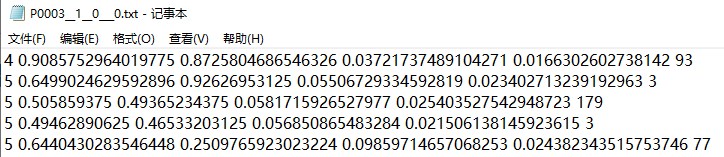
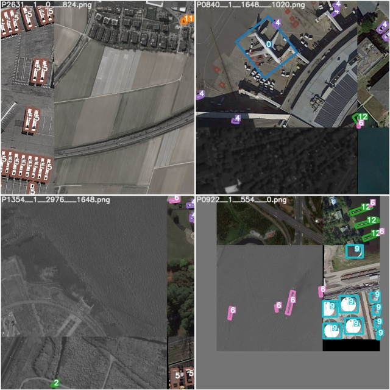
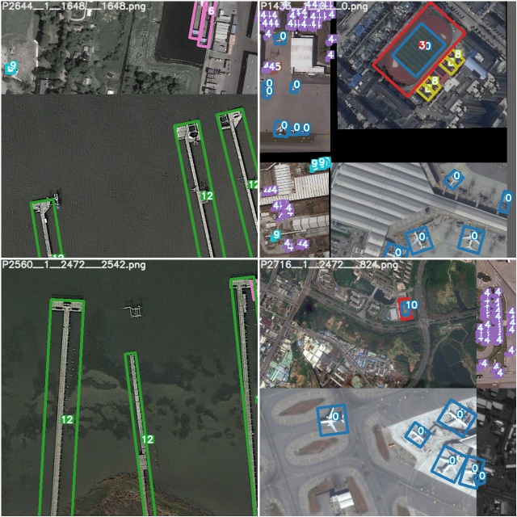
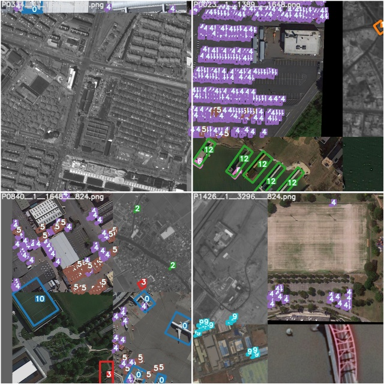
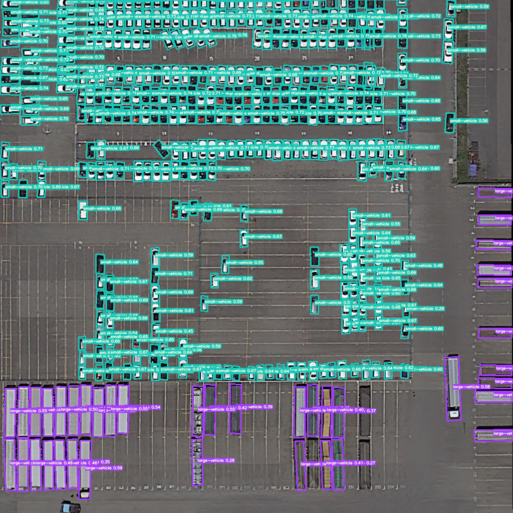

# YOLOv5_DOTA_OBB
YOLOv5 in DOTA_OBB dataset with CSL_label.(Oriented Object Detection)


## Datasets and pretrained checkpoint
* `Datasets` : [DOTA](https://link.zhihu.com/?target=http%3A//captain.whu.edu.cn/DOTAweb/)
* `Pretrained Checkpoint or Demo Files` : 
    * `train,detect_and_evaluate_demo_files`:  | [Baidu Drive(pw:6666)](https://pan.baidu.com/s/19BGy_UIdk8N-mSjHBMI0QQ). |  [Google Drive](https://drive.google.com/file/d/1MdKTgXQpHFBk_RN9UDSIB42M5e8zQaTP/view?usp=sharing) |
    * `yolov5x.pt`:  | [Baidu Drive(pw:6666)](https://pan.baidu.com/s/1pH6EGKZiIyGtoqUe3F8eWQ). |  [Google Drive](https://drive.google.com/file/d/1hGPB7iOl3EmB2vfm44xMpHJV8hPufHn2/view?usp=sharing) |
    * `yolov5l.pt`:  | [Baidu Drive(pw:6666)](https://pan.baidu.com/s/16is2mx879jk9_4RHwcIgKw). |  [Google Drive](https://drive.google.com/file/d/12ljwafulmAP1i9XsaeYvEnIUd18agJcT/view?usp=sharing) |
    * `yolov5m.pt`:  | [Baidu Drive(pw:6666)](https://pan.baidu.com/s/1ZQoxEB-1mtBAk3A-Rt85-A). |  [Google Drive](https://drive.google.com/file/d/1VSDegIUgTh-fMDIjuwTSQaZ1w5bVx2Vd/view?usp=sharing) |
    * `yolov5s.pt`:  | [Baidu Drive(pw:6666)](https://pan.baidu.com/s/1jm7ijb0a3LVkg8P2bkmJnw). |  [Google Drive](https://drive.google.com/file/d/1ePo6OM8MbxG8nAkZS_Bt7cmnChSlKBmo/view?usp=sharing) |
    * `YOLOv5_DOTAv1.5_OBB.pt`:  | [Baidu Drive(pw:6666)](https://pan.baidu.com/s/1WSJFwwM5nyWgPLzAV6rp8Q). |  [Google Drive](https://drive.google.com/file/d/171xlq49JEiKJ3L-UEV9tICXltPs92dLk/view?usp=sharing) |

## Fuction
* `train.py`.  Train.

* `detect.py`. Detect and visualize the detection result. Get the detection result txt.

* `evaluation.py`.  Merge the detection result and visualize it. Finally evaluate the detector


## Installation  (Linux Recommend, Windows not Recommend)
`1.` Python 3.8 with all requirements.txt dependencies installed, including torch==1.6, opencv-python==4.1.2.30, To install run:
```
$   pip install -r requirements.txt
```
`2.` Install swig
```
$   cd  \.....\yolov5_DOTA_OBB\utils
$   sudo apt-get install swig
```
`3.` Create the c++ extension for python
```
$   swig -c++ -python polyiou.i
$   python setup.py build_ext --inplace
```


## More detailed explanation
想要了解相关实现的细节和原理可以看我的知乎文章:   

* [YOLOv5_DOTAv1.5(遥感旋转目标检测，全踩坑记录)](https://zhuanlan.zhihu.com/p/357992219).
* [YOLOv5_DOTA无人机/遥感旋转目标检测项目代码（从数据集制作、模型训练、性能评估全套流程）](https://zhuanlan.zhihu.com/p/358072483).
* [YOLOv5在无人机/遥感场景下做旋转目标检测时进行的适应性改建详解](https://zhuanlan.zhihu.com/p/358441134).
* [【旋转目标检测】YOLOv5应对无人机/遥感场景相关难点的解决方案](https://zhuanlan.zhihu.com/p/359249077).


## Usage Example
`1.` `'Get Dataset' `
 
* Split the DOTA_OBB image and labels. Trans DOTA format to YOLO longside format.

* You can refer to  [hukaixuan19970627/DOTA_devkit_YOLO](https://github.com/hukaixuan19970627/DOTA_devkit_YOLO).

* The Oriented YOLO Longside Format is:

```
$  classid    x_c   y_c   longside   shortside    Θ    Θ∈[0, 180)


* longside: The longest side of the oriented rectangle.

* shortside: The other side of the oriented rectangle.

* Θ: The angle between the longside and the x-axis(The x-axis rotates clockwise).x轴顺时针旋转遇到最长边所经过的角度
```
`WARNING: IMAGE SIZE MUST MEETS 'HEIGHT = WIDTH'`



`2.` `'train.py'` 

* All same as [ultralytics/yolov5](https://github.com/ultralytics/yolov5).  You better train demo files first before train your custom dataset.
* Single GPU training:
```
$ python train.py  --batch-size 4 --device 0
```
* Multi GPU training:  DistributedDataParallel Mode 
```
python -m torch.distributed.launch --nproc_per_node 4 train.py --sync-bn --device 0,1,2,3
```






`3.` `'detect.py'` 
    
* Download the demo files.
* Then run the demo. Visualize the detection result and get the result txt files.

```
$  python detect.py
```





`4.` `'evaluation.py'` 

* Run the detect.py demo first. Then change the path with yours:
```
evaluation
(
        detoutput=r'/....../DOTA_demo_view/detection',
        imageset=r'/....../DOTA_demo_view/row_images',
        annopath=r'/....../DOTA_demo_view/row_DOTA_labels/{:s}.txt'
)
draw_DOTA_image
(
        imgsrcpath=r'/...../DOTA_demo_view/row_images',
        imglabelspath=r'/....../DOTA_demo_view/detection/result_txt/result_merged',
        dstpath=r'/....../DOTA_demo_view/detection/merged_drawed'
)
```

* Run the evaluation.py demo. Get the evaluation result and visualize the detection result which after merged.
```
$  python evaluation.py
```


## 有问题反馈
在使用中有任何问题，欢迎反馈给我，可以用以下联系方式跟我交流

* 知乎（@[略略略](https://www.zhihu.com/people/lue-lue-lue-3-92-86)）
* 代码问题提issues,其他问题请知乎上联系


## 感激
感谢以下的项目,排名不分先后

* [ultralytics/yolov5](https://github.com/ultralytics/yolov5).
* [Thinklab-SJTU/CSL_RetinaNet_Tensorflow](https://github.com/Thinklab-SJTU/CSL_RetinaNet_Tensorflow).

## 关于作者

```javascript
  Name  : "胡凯旋"
  describe myself："咸鱼一枚"
  
```
## 更多
* 大家也可以参考另一个项目[BossZard/rotation-yolov5](https://github.com/BossZard/rotation-yolov5). , 该项目在比较早的时候就将yolov5用于旋转目标检测，也是本项目的启发之一;
* 更多的旋转目标检测器可以参考[SJTU-Thinklab-Det/DOTA-DOAI](https://github.com/SJTU-Thinklab-Det/DOTA-DOAI). 里面有配套论文与开源代码.
